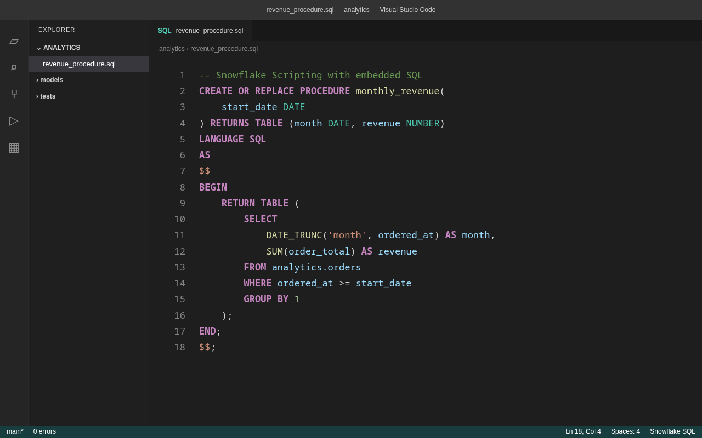

<!-- i18n: language-switcher -->
[English](README.md) | [日本語](README.ja.md)

# Snowflake SQL

Focused Snowflake SQL syntax highlighting **and formatting** for Visual Studio Code, backed by the
same engine used by [sql-dialect-fmt](https://github.com/hjosugi/sql-dialect-fmt).



## Features

- Document and selection formatting (**Format Document** / **Format Selection**), with format-on-save
- Snowflake SQL keywords and built-in types
- Snowflake Scripting and `$$ ... $$` routine bodies
- line (`--`, `//`) and block (`/* ... */`) comments
- strings, quoted identifiers, numeric literals, and operators
- positional `$1`, session `$name`, bind `:name`, and `?` variables
- `@stage`, `@~`, `@%table`, and namespaced stage references
- `.sql`, `.snowsql`, and `.sfsql` file associations

- **Language ID:** `snowflake-sql`
- **Scope name:** `source.snowflake-sql`
- **File types:** `.sql`, `.snowsql`, `.sfsql`

## Formatting

The extension registers a formatter for `snowflake-sql` documents, so **Format Document**,
**Format Selection**, and `"editor.formatOnSave"` all work out of the box. Formatting runs entirely
on your machine: the bundled WebAssembly build of the formatter is the same engine that powers the
CLI and the Snowsight browser extension. Nothing is sent over the network.

Formatting is mechanically **lossless and idempotent** — input that cannot be parsed is passed
through unchanged, and `format(format(x)) == format(x)`.

To make it the default formatter for these files, add to your settings:

```json
"[snowflake-sql]": {
  "editor.defaultFormatter": "sql-dialect-fmt.snowflake-sql-sql-dialect-fmt",
  "editor.formatOnSave": true
}
```

### Settings

| Setting | Default | Description |
| --- | --- | --- |
| `sqlDialectFmt.dialect` | `snowflake` | SQL dialect (`snowflake` or `databricks`). |
| `sqlDialectFmt.lineWidth` | `100` | Target line width before wrapping. |
| `sqlDialectFmt.indentWidth` | `4` | Spaces per indent level. |
| `sqlDialectFmt.uppercaseKeywords` | `true` | Upper-case SQL keywords. |

The keyword and type word lists are kept in lock-step with the formatter's own
lexer/highlighter by tests in `sql-dialect-fmt-highlight` (`tests/textmate.rs`): every word the
grammar scopes as a keyword or type must be classified the same way by
`sql_dialect_fmt_highlight::classify`, so the grammar can't drift from the rest of the toolchain.

## Use

1. Install the extension.
2. Open a `.sql`, `.snowsql`, or `.sfsql` file.
3. If needed, choose **Change Language Mode** and select **Snowflake SQL**.
4. Run **Format Document** (`Shift+Alt+F`) or **Format Selection**.

This extension contributes syntax highlighting, language metadata, and a local formatter. It does
not execute SQL against Snowflake or connect to any account. For CLI formatting and other
integrations, see the [main project README](https://github.com/hjosugi/sql-dialect-fmt#readme).

## Privacy

The extension runs no telemetry or analytics, makes no network requests, and performs no remote
formatting. Formatting is done locally by a bundled WebAssembly module; your SQL never leaves the
machine. The extension only contributes static language configuration, a TextMate grammar, and the
local formatter. See the
[privacy policy](https://github.com/hjosugi/sql-dialect-fmt/blob/main/docs/PRIVACY.md).

## Other editors

This directory also carries integrations for other editors, all driven by the same
`sql-dialect-fmt-lsp` language server (`cargo install sql-dialect-fmt-lsp`):

- [`nvim/`](nvim/) — a small Neovim plugin: `snowflake-sql` filetype, LSP setup, and
  conform.nvim/null-ls recipes for CLI-based formatting.
- [`zed/`](zed/) — a Zed extension (dev install): Snowflake SQL language backed by the
  bundled tree-sitter grammar plus the language server.
- [`helix/`](helix/) — a documented `languages.toml` snippet for Helix (no plugin system).

## Support and source

- [Report an issue](https://github.com/hjosugi/sql-dialect-fmt/issues)
- [Source code](https://github.com/hjosugi/sql-dialect-fmt)
- License: [0BSD](LICENSE.md)
